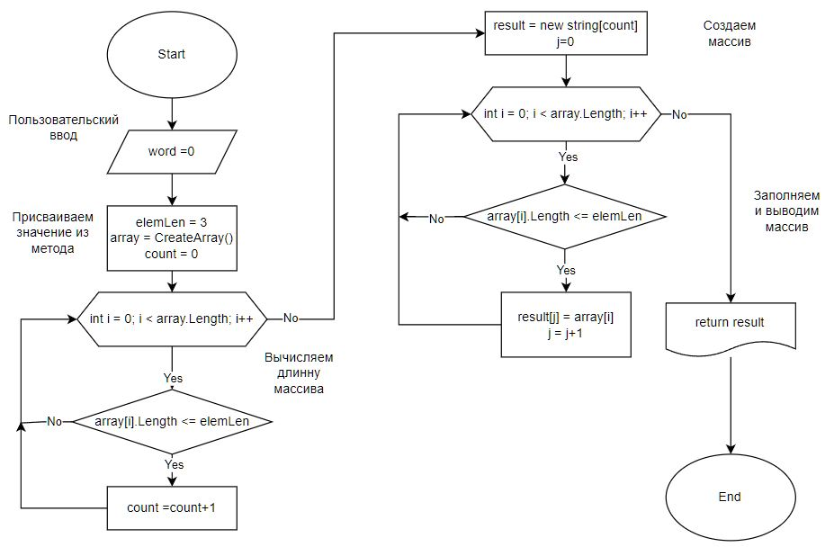
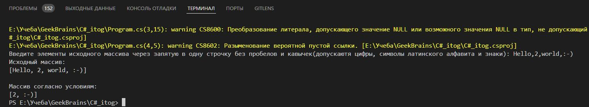

# Итоговая контрольная работа по основному блоку. #

Написать программу, которая из имеющегося массива строк формирует новый массив из строк, длина которых меньше, либо равна 3 символам. Первоначальный массив можно ввести с клавиатуры, либо задать на старте выполнения алгоритма. При решении не рекомендуется пользоваться коллекциями, лучше обойтись исключительно массивами.

## План выполнения ##
1. Создать репозиторий на GitHub
2. Нарисовать блок-схему алгоритма (можно обойтись блок-схемой основной содержательной части, если вы выделяете её в отдельный метод)
3. Снабдить репозиторий оформленным текстовым описанием решения (файл README.md)
4. Написать программу, решающую поставленную задачу
5. Использовать контроль версий в работе над этим небольшим проектом (не должно быть так, что всё залито одним коммитом, как минимум этапы 2, 3, и 4 должны быть расположены в разных коммитах)

```sh
Примеры:
[“Hello”, “2”, “world”, “:-)”] → [“2”, “:-)”]
[“1234”, “1567”, “-2”, “computer science”] → [“-2”]
[“Russia”, “Denmark”, “Kazan”] → []
```

## Описание кода. ##

1. **Выводим сообщение пользователя для ввода значений с попощю Console.Write.** 
2. **Создаем переменную в которую помещается значение от пользователя.** 
3. **Проверяем если длинна переменной меньше необходимой, выводим предупреждающее сообщение. Если длинна больше идем выполнять программу.**
4. **Создаем метод CreateArray для создания исходного массива через Split.**
    * Создаем массив и присваиваем ему значения из переменной через функцию Split.
5. **Создаем метод PrintArray для вывода массива.**
    * Перебираем элементы массива через цикл For, через запятую. 
6. **Создаем метод OutArray для создания массива согласно условиям задачи.**
    * Создаем массив, которому присваиваем значение метода CreateArray.
    * Находим длинну результирующего массива сравнивая длинны элементов исходного массива с условием (<=3). Элементы перебираем через цикл For. 
    * Создаем результирующий массив. 
    * Через цикл  for  перебираем исходный массив и если длинна элемента соответствует условиям, заполняем элемент результирующего массива элементом из исходного. 
    * Возвращаем массив: return result.
7. **Выводим исходный массив и конечный.**
    * Создаем пустой строчный массив и присваиваем значение метода CreateArray.
    * Выводим исходный массив, метод PrintArray.
    * Вызываем метод PrintArray с методом OutArray и выводим конечный массив. 

Диаграмма метода OutArray.


Тест.
